  
Frontend Developer focused on React, TypeScript, and Next.js.

  I enjoy working across UI/UX and frontend development —  
  shaping user flows and interfaces in Figma, then turning them into responsive, tested products.
  
  I care about clear structure, polished interactions,  
  and validating the final experience through tests and browser QA.

  

  

    
    
    
    
    
    
  

  
  

    
    
    
    
    
    
  

  
  

    
    
    
    
    
    
    
    
  

  

  

  

  
  

